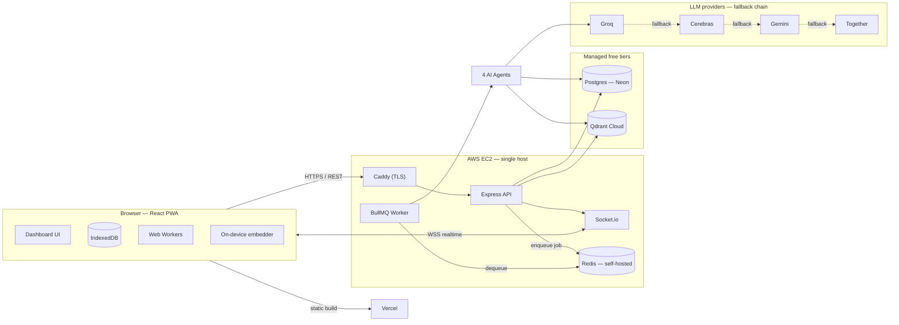
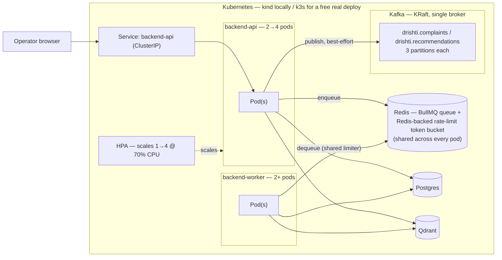
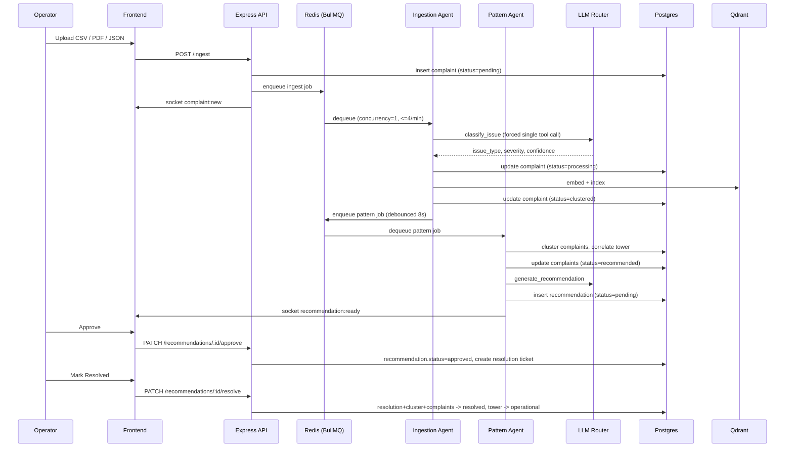

# Drishti — Telecom AI Operations Platform

> _"From complaint to resolution — intelligently."_

## 🔴 Live Demo

| | URL |
|---|---|
| **Frontend** | [https://drishti-agent-ai.vercel.app](https://drishti-agent-ai.vercel.app) |


**Login credentials:**
> **Email:** `admin@drishti.com` &nbsp;&nbsp; **Password:** `drishti@123`

---

## What this project is

Drishti is an **AI operations dashboard for telecom companies**. Operators receive thousands of
customer complaints a day across scattered channels (email, PDF, SMS, CSV). Drishti reads
them automatically, groups similar ones, links them to the cell tower at fault, and suggests a fix —
all on one real-time command-center screen.

It replaces slow manual triage with an automated pipeline, and lets an operator **monitor** the
network on a live map, **ask questions** in plain English, and **resolve** issues from one place.

---

## Why this project

Drishti was built to demonstrate the exact frontend capabilities Sarvam AI's
**Frontend Engineer, Chanakya** role calls for — production-grade interfaces for strategic-sector
and enterprise AI that hold up in offline-first, low-bandwidth, hardened-client environments.

| Chanakya requirement | Where it lives in Drishti |
|---|---|
| Geospatial overlays | React-Leaflet map — status pins, complaint heatmap, click-to-place towers |
| Simulation UIs | What-if tower-failure impact simulator (haversine redistribution model) |
| Natural-language access layers | RAG chat grounded in real complaint data |
| Ontology viewers | D3 force-directed network graph (towers → clusters → recommendations) |
| Data ingestion dashboards | Drag-drop multi-file upload with live AI pipeline progress tracker |
| Complex enterprise workflows | Real-time approvals, escalation, and resolution flows |
| State management | Zustand stores + offline action queue |
| Data visualisation | D3 · React-Leaflet · Recharts (4-tab analytics) |
| REST + WebSocket integration | Axios + Socket.io (live complaints, alerts, tower status) |
| Performance engineering | Code-splitting + lazy-loaded heavy chunks |
| Offline-first / low-bandwidth | PWA + IndexedDB persistence + queue-and-sync of offline actions |
| WebGL / Three.js (bonus) | 3D network command view (tower pillars, coverage domes, OrbitControls) |

---

## How it works

```
 Complaint comes in        AI reads & tags it       Similar ones grouped
 (CSV / PDF / JSON)    →   (issue + severity)   →   (cluster by area)
                                                            ↓
   Operator resolves    ←   AI suggests a fix    ←   Cluster linked to
   (approve / reject)        (root cause +            nearest tower
                              action)
```

Four AI agents drive the pipeline:

| Agent | Trigger | Does |
|---|---|---|
| **Ingestion** | file uploaded | parse → classify → geocode → embed → store |
| **Pattern** | every N complaints | cluster → link to tower → write recommendation |
| **NL Query** | operator asks a question | RAG (Groq + Qdrant) → grounded answer with map/chart hints |
| **Approval** | operator approves/rejects | update statuses → resolve complaints |

All agents use a **provider-agnostic LLM router** (`Groq → Gemini → Together`) with multi-key rotation — no single paid API is required.

---

## System Design

### High-Level Design (HLD)



**Why these boundaries:**
- **Frontend/backend split** — frontend is fully static (Vercel), so it scales/CDNs for free; the only stateful thing is the single EC2 host running the API + queue.
- **Job queue between ingestion and classification** — LLM calls are slow and rate-limited (free-tier Groq), so ingestion never blocks the HTTP response; a BullMQ worker drains the queue at a pace the free tier tolerates (concurrency 1, ≤4 jobs/min).
- **Redis is self-hosted on the same host, not Upstash** — BullMQ polls Redis continuously even when idle, which chews through Upstash's free command quota; a local container has no such limit.
- **Vector store and Postgres are both external managed services** — free tier, automatic backups, and it means the EC2 host only needs to survive as a stateless-ish compute box (see [`DEPLOY.md`](DEPLOY.md)).
- **LLM calls never touch the browser** — the frontend only talks to the Express API; provider selection, key rotation, and prompts all live server-side so API keys are never exposed to the client.

### Scalable variant — Kubernetes + Kafka

The EC2 deployment above is one process on one host by design — cheap, simple, sufficient for the traffic it actually serves. [`k8s/`](k8s/) is a separate, coexisting variant of the exact same application, restructured to demonstrate horizontal scaling as a first-class property rather than a single instance. Full setup: [`k8s/README.md`](k8s/README.md).



What actually makes this scalable, not just diagrammed that way (every claim below was run and verified — see `k8s/README.md` for the exact commands):
- **`backend-api` and `backend-worker` are separate Deployments**, not one process — the EC2 build runs both in a single Node process ([`index.ts`](backend/src/index.ts) calling `startWorkers()` and `httpServer.listen()` together); here, `PROCESS_ROLE=api|worker` splits them so either can restart, crash, or scale independently of the other.
- **`backend-api` autoscales on real CPU metrics** via a `HorizontalPodAutoscaler` (1→4 replicas, 70% target) — confirmed live: `kubectl get hpa` reporting real, non-`<unknown>` utilization against `metrics-server`.
- **`backend-worker` scales safely because the rate limit is enforced in Redis, not per-process** — BullMQ's limiter is a token bucket keyed by queue name in Redis, shared by every worker reading that queue, not a counter local to one instance (verified by reading `bullmq`'s own source, not assumed). Tested directly: scaled to 2 replicas, submitted 3 complaints, and the two pods' logs showed the jobs split across both with no double-processing and no rate-limit violation.
- **Kafka topics are pre-provisioned with 3 partitions**, not left on Kafka's auto-create default of 1 — partitions are the actual unit of consumer parallelism; a 1-partition topic caps you at exactly one active consumer per group no matter how many you add.
- **Every stateful piece (Postgres, Qdrant, Redis, Kafka) runs in-cluster**, so the whole stack — not just the app tier — is expressed as Kubernetes objects with explicit resource requests/limits, which is also what makes the HPA and future capacity planning meaningful in the first place.

The honest limits of this, stated plainly rather than glossed over: Kafka is a **single broker** here (KRaft mode) — the partitioning gives you consumer *parallelism*, not broker fault-tolerance; real replication needs 3 brokers, a genuine resource jump covered in `k8s/README.md`'s last section. And nothing consumes the Kafka topics today beyond manual verification — the producer side (`backend/src/events/kafkaProducer.ts`) is wired into `ingest.ts`/`recommendations.ts` and is real and running, but the audit/replay consumer that would actually read from it long-term is future work, not built yet.

### Low-Level Design (LLD)

#### Request flow — complaint to resolution



#### Status flow across tables

| Table | States | Set by |
|---|---|---|
| `complaints` | `pending → processing → clustered → recommended → resolved` (or `failed`) | ingestion agent, pattern agent, resolve endpoint, worker failure handler |
| `clusters` | `open → recommended → resolved` | pattern agent, resolve endpoint |
| `recommendations` | `pending → approved / rejected` | approve/reject endpoints |
| `resolutions` | `open → resolved` | created on approve, closed on resolve |
| `towers` | `operational ⇄ degraded ⇄ critical` (auto, by `active_complaints` count) · `offline` (manual only) → `operational` (on resolve) | pattern agent (auto-downgrade), resolve endpoint (reset) |

> **Known limitation:** `recommendations.status` never transitions to `resolved` in the database — only its linked `resolutions` row does. The UI's "In Progress" tab hides a resolved card using local component state instead, so a resolved recommendation reappears there after a page reload even though the underlying tower/complaints are correctly resolved. Documenting this honestly rather than glossing over it — status for one logical "incident" is currently spread across four tables instead of one source of truth, which is the main thing on the backlog to fix.

#### LLM provider routing

Every agent task (`classify`, `pattern`, `nl_query`, `approval`) routes through the same fallback chain: **Groq → Cerebras → Gemini → Together**, filtered to only providers with a configured key.
- **Key rotation** — Groq supports multiple keys (`GROQ_API_KEY_2…_5`); a rotating pointer spreads load across them, and a key that returns 429/401/403/5xx is skipped in favor of the next one before falling through to Cerebras.
- **Circuit breaker** — a fallback provider that gets rate-limited is parked on a 5-minute cooldown so subsequent requests skip straight past it instead of eating the latency of a doomed call every time.
- **Single-shot mode (`forceTool`)** — classification forces exactly one tool call and returns immediately after executing it, skipping the follow-up completion round-trip — roughly half the token cost of the default multi-turn tool loop used by the other three agents.

#### RAG pipeline

Document-aware hybrid chunking (not fixed-size token chunking):

| Source | Strategy |
|---|---|
| SMS / email, or any text < 150 words | whole text = 1 chunk |
| CSV | 1 row = 1 chunk |
| PDF, < 300 words | sentence chunking (200-word chunks, 50-word overlap) |
| PDF, ≥ 300 words | detect section headings first, then sentence-chunk each section |

Embeddings run **on-device** in the backend process (`Xenova/all-MiniLM-L6-v2`, 384-dim, via `@xenova/transformers`) — no per-token embedding cost, works fully offline once the ~30MB model is cached. Chunks are stored in Qdrant with `{ text, source_id, source_type, location_hint, chunk_index }` payloads; retrieval is cosine similarity, top 5, fed into the NL Query agent's context window.

#### Kubernetes scaling mechanics (`k8s/` variant)

- **HPA formula** — `HorizontalPodAutoscaler` on `backend-api` targets 70% average CPU utilization across pods, `minReplicas: 1`, `maxReplicas: 4`. It polls `metrics-server` every 15s (k8s default) and computes `desiredReplicas = ceil(currentReplicas × currentUtilization / targetUtilization)`; below target it scales down (with a stabilization window to avoid flapping), above it scales up immediately.
- **Why `backend-worker` isn't on an HPA too** — its bottleneck is Groq's external rate limit (≤4 jobs/min), not CPU. Autoscaling on CPU would add pods without moving that ceiling; scaling it is a manual `kubectl scale` because the right trigger (queue depth vs. external quota) isn't a metric Kubernetes' CPU-based HPA understands out of the box — a queue-depth-based autoscaler (KEDA) would be the correct next step, not built here.
- **Redis-backed rate limiter, concretely** — BullMQ's `moveToActive` script reads/writes a single Redis key (`bull:<queue>:limiter`) shared by every `Worker` instance constructed against that queue name, regardless of which pod or process it runs in. This is why running `backend-worker` at 2+ replicas is safe by construction, not by luck: two pods racing to claim the next job both hit the same Redis-side token bucket, so the aggregate throughput across all replicas stays under the configured limit — verified directly (see the LLD's scalable-variant section above).
- **Kafka partition assignment** — with 3 partitions per topic and a consumer group of *N* instances (N ≤ 3), Kafka's group coordinator assigns each instance a disjoint subset of partitions; a 4th instance in the same group would sit idle with zero partitions assigned. This is why the partition count is chosen deliberately (3) rather than left on the auto-create default (1) — it sets the actual ceiling on how many consumers can ever do useful work in parallel, independent of how many you run.

---

## Key engineering decisions

- **Offline-first** — every Zustand store persists to IndexedDB via `idb-keyval`; PWA service worker precaches the app shell
- **On-device AI fallback** — NL assistant runs `all-MiniLM-L6-v2` in the browser via Transformers.js / ONNX Runtime Web for zero-backend offline search
- **Offline action queue** — approvals/resolves made offline are persisted and replayed on reconnect
- **Multi-key Groq rotation** → Gemini fallback with rate-limit cooldown — throttled keys never break a request
- **Web Workers** — CSV/JSON/PDF parsed off the main thread with real-time progress
- **Code splitting** — Three.js, D3, Recharts lazy-loaded off the critical path

---

## Tech stack

**Frontend:** React 18 · TypeScript · Vite · Tailwind · Zustand · React-Leaflet · Recharts · D3 · Three.js · Socket.io-client · PWA (Workbox)

**Backend:** Node.js · Express · TypeScript · BullMQ · PostgreSQL (Neon) · Qdrant Cloud · Redis (Upstash) · local embeddings (`@xenova/transformers`) · Socket.io

**Infrastructure:** AWS EC2 (t2.micro) · Caddy (HTTPS/TLS) · Docker Compose · Vercel (frontend)

---

## Run locally

**Prerequisites:** Node.js 18+, Docker, free [Groq API key](https://console.groq.com)

```bash
# 1. Clone + configure
git clone https://github.com/AnkitJhadev/drishti.git
cd drishti
cp .env.example .env          # set GROQ_API_KEY and JWT_SECRET

# 2. Start infrastructure
docker compose up -d          # Postgres + Qdrant + Redis

# 3. Backend (terminal 1)
cd backend && npm install && npm run dev      # → http://localhost:4000

# 4. Frontend (terminal 2)
cd frontend && npm install && npm run dev     # → http://localhost:3000
```

Log in with `admin@drishti.com` / `drishti@123`, then drop a file from [`sample-data/`](sample-data/) into the Ingest panel.

### Minimum `.env` config

| Variable | Required? | Notes |
|---|---|---|
| `GROQ_API_KEY` | **Yes** | Free from [console.groq.com](https://console.groq.com). Add `GROQ_API_KEY_2…_10` to pool quota. |
| `JWT_SECRET` | **Yes** | Any long random string (`openssl rand -base64 48`) |
| `GEMINI_API_KEY` | Optional | Fallback LLM when Groq quota is spent |

---

## Project structure

```
drishti/
├── backend/src/
│   ├── routes/        REST endpoints (auth, ingest, complaints, towers, ai, …)
│   ├── agents/        4 AI agents (ingestion, pattern, nlQuery, approval)
│   ├── llm/           provider router (Groq → Gemini → Together)
│   ├── rag/           chunker → embedder → indexer → retriever
│   ├── parsers/       CSV + PDF + JSON readers (strict validation)
│   ├── queue/         BullMQ jobs + worker
│   ├── db/            Postgres, Qdrant, migrations, seed
│   └── websocket/     Socket.io server
└── frontend/src/
    ├── pages/         Login, Dashboard
    ├── components/    map · analytics · complaints · ai · approval · ontology · simulation · three
    ├── stores/        Zustand (complaints, towers, alerts, aiChat, auth, action-queue)
    ├── workers/       Web Workers (CSV/JSON/PDF parsing off main thread)
    └── services/      api · socket · offline action-queue · localEmbedder
```

---

## API reference

```
POST   /auth/login
GET    /complaints   GET /complaints/:id   PATCH /complaints/:id/resolve
POST   /ingest                             → upload .csv / .pdf / .json
POST   /ingest/records                     → client-parsed records (Web Worker path)
GET    /towers   GET /towers/:id   POST /towers
GET    /alerts   PATCH /alerts/:id/read
GET    /recommendations   PATCH /recommendations/:id/{approve|reject|resolve}
POST   /ai/chat                            → natural-language RAG query
DELETE /ai/chat/history                    → clear conversation memory
GET    /ontology                           → graph nodes + links for D3
```

All routes except `/auth/login` require `Authorization: Bearer <token>`.

---

## Ingestion format

Accepts `.csv`, `.pdf`, and `.json` only. Invalid rows are rejected per-row with a reason shown in the UI.

**CSV** — must have `complaint` + `location` columns (`phone` optional):
```csv
complaint,location,phone
"No network signal since morning",Bandra Mumbai,9820011001
```

**JSON** — array of `{ complaint, location, phone? }`:
```json
[{ "complaint": "No signal in Bandra", "location": "Bandra Mumbai" }]
```

**PDF** — complaint report with a `Location:` field and complaint text body.

---

## Deployment

Frontend on **Vercel**, backend on **AWS EC2 t2.micro** with Caddy for HTTPS.
Managed services: **Neon** (Postgres) · **Upstash** (Redis) · **Qdrant Cloud**.

Full runbook: [`DEPLOY.md`](DEPLOY.md)

---

## Kubernetes + Kafka (local demo)

A separate, fully self-contained deployment variant — the backend split into independently-scalable `api`/`worker` Kubernetes Deployments, with a real Kafka event log (KRaft mode, single broker) running alongside the primary BullMQ job pipeline for audit/replay. Runs entirely locally via `kind`, no cost, no dependency on the EC2/Vercel deployment or its credentials.

Full walkthrough (build → deploy → verify, every step actually run before being documented): [`k8s/README.md`](k8s/README.md)
